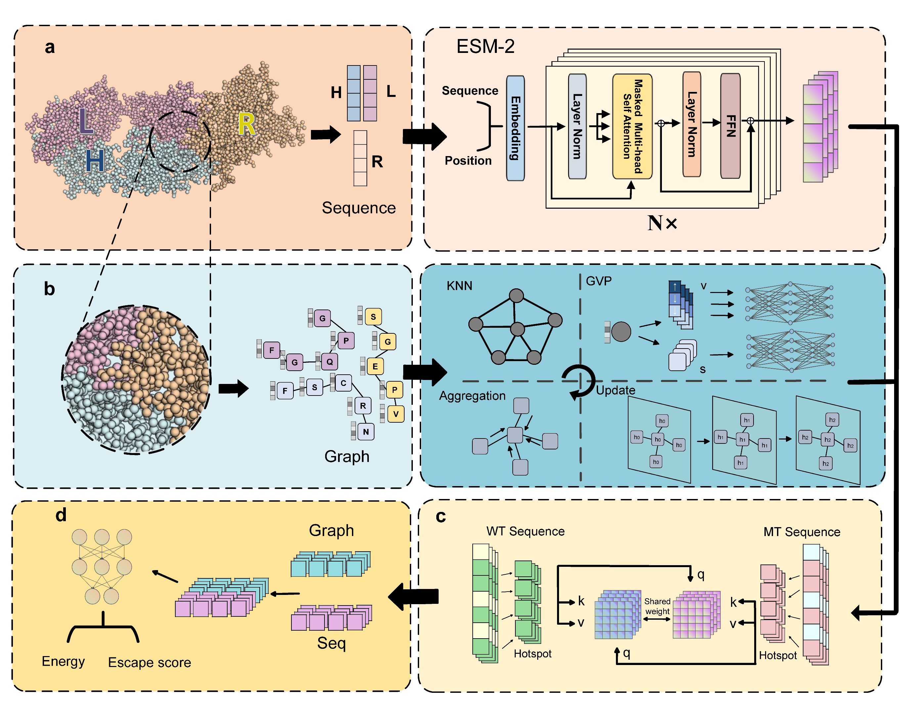

# PABbind
## Predicting Immune Evasion of Antigens Triggered by Mutations via Hierarchical Geometric Deep Learning

## Setup Environment
- All you need is install the following packages in any version:
    - pyg
    - torch
    - abnumber
    - biopython
    - rdkit
    - mdanalysis
    - ems
## We provide the following dataset in abdataset:
    - dmscheckclean.csv : 102 antibody and antigen pairs(wildtype=1 meant the antigen is wild type)
    - dms_singlemut.csv : 20,172 sing mut data points
    - dms_multimut.csv : 110,652 multimut data points
    - 10fold4169.csv : S4169 result
    - 10fold645.csv : S645 result
    - external_test.csv : external test dataset of ly16 and RNG10987
    - escape.csv :  binding of variants
    - escape_result.csv : escape result of variants

## Generate the graph emb and seq emb
### 1, Get [ESM parameter](https://dl.fbaipublicfiles.com/fair-esm/models/esm2_t30_150M_UR50D.pt)
### 2, Get the graph emb and seq emb(start with file like dmscheckclean.csv and cleaned pdb files in graph/{your_folder}/pdb)
    python process.py --data_name ./abdataset/dmscheckclean.csv --pdb_path ./graph/dms/ --esm_path ./esm2_t30_150M_UR50D/ --mt_path ./abdataset/dms_multimut.csv
## Train/inference
    python train_grap_lg_dms.py -c ./{config.json}
